<h1 align="center">
  
  
</h1>
<h3 align="center">Currently specializing in Web development and iOS development</h3>

- 🎓 Currently studying **Computer Science** at Purdue University

- 💻 I enjoy learning about new technologies as well as new ways to accomplish goals

- 🌱 I’m currently learning **Swift and React**

- 🏀 My favorite recreational activities are riding my bike and playing basketball

- 📫 How to reach me **asthatabusiness@gmail.com**

<h3 align="left">Connect with me:</h3>

<h3 align="left">Languages and Tools:</h3>

          

<h1 align="center">Projects based on Category</h1>
<h3 align="left">Swift Projects</h3>
<a href="https://github.com/athata1/Spotflix">
  <picture>
    <source 
      srcset="pins/GithubSpotflixDark.svg"
      media="(prefers-color-scheme: dark)"
    />
    <source
      srcset="pins/GithubSpotflixLight.svg"
      media="(prefers-color-scheme: light), (prefers-color-scheme: no-preference)"
    />
    
  </picture>
</a>
<a href="https://github.com/BooksManager/BookManager">
  <picture>
    <source 
      srcset="https://github-readme-stats.vercel.app/api/pin/?username=BooksManager&repo=BookManager&theme=vue-dark"
      media="(prefers-color-scheme: dark)"
    />
    <source
      srcset="https://github-readme-stats.vercel.app/api/pin/?username=BooksManager&repo=BookManager"
      media="(prefers-color-scheme: light), (prefers-color-scheme: no-preference)"
    />
    
  </picture>
</a>
<h3 align="left">Web Projects</h3>
<a href="https://github.com/athata1/CSTrackOptimizer">
  <picture>
    <source 
      srcset="pins/GithubCSTrackOptimizerDark.svg"
      media="(prefers-color-scheme: dark)"
    />
    <source
      srcset="pins/GithubCSTrackOptimizerLight.svg"
      media="(prefers-color-scheme: light), (prefers-color-scheme: no-preference)"
    />
    
  </picture>
</a>
<a href="https://github.com/athata1/CSTrackOptimizerReact">
  <picture>
    <source 
      srcset="pins/GithubCSTrackOptimizerReactDark.svg"
      media="(prefers-color-scheme: dark)"
    />
    <source
      srcset="pins/GithubCSTrackOptimizerReactLight.svg"
      media="(prefers-color-scheme: light), (prefers-color-scheme: no-preference)"
    />
    
  </picture>
</a>
<a href="https://github.com/athata1/TodoApp">
  <picture>
    <source 
      srcset="pins/GithubTodoAppDark.svg"
      media="(prefers-color-scheme: dark)"
    />
    <source
      srcset="pins/GithubTodoAppLight.svg"
      media="(prefers-color-scheme: light), (prefers-color-scheme: no-preference)"
    />
    
  </picture>
</a>
<h3 align="left">Python Projects</h3>
<a href="https://github.com/athata1/ValorantClipper">
  <picture>
    <source 
      srcset="pins/GithubValorantClipperDark.svg"
      media="(prefers-color-scheme: dark)"
    />
    <source
      srcset="pins/GithubValorantClipperLight.svg"
      media="(prefers-color-scheme: light), (prefers-color-scheme: no-preference)"
    />
    
  </picture>
</a>
<a href="https://github.com/athata1/ImgToAscii">
  <picture>
    <source 
      srcset="pins/GithubImgToAsciiDark.svg"
      media="(prefers-color-scheme: dark)"
    />
    <source
      srcset="pins/GithubImgToAsciiLight.svg"
      media="(prefers-color-scheme: light), (prefers-color-scheme: no-preference)"
    />
    
  </picture>
</a>
<h3 align="left">Java Projects</h3>

  <a href="https://github.com/athata1/Stock-Analyzer---Akhil-Thata">
    <picture>
      <source 
        srcset="pins/GithubStockAnalyzerDark.svg"
        media="(prefers-color-scheme: dark)"
      />
      <source
        srcset="pins/GithubStockAnalyzerLight.svg"
        media="(prefers-color-scheme: light), (prefers-color-scheme: no-preference)"
      />
      
    </picture>
  </a>
  <a href="https://github.com/athata1/NonogramColor">
    <picture>
      <source 
        srcset="pins/GithubNonogramColorDark.svg"
        media="(prefers-color-scheme: dark)"
      />
      <source
        srcset="pins/GithubNonogramColorLight.svg"
        media="(prefers-color-scheme: light), (prefers-color-scheme: no-preference)"
      />
      
    </picture>
  </a>

<a href="https://github.com/athata1/PathfindingVisualizer">
  <picture>
      <source 
        srcset="pins/GithubPathfindingVisualizerDark.svg"
        media="(prefers-color-scheme: dark)"
      />
      <source
        srcset="pins/GithubPathfindingVisualizerLight.svg"
        media="(prefers-color-scheme: light), (prefers-color-scheme: no-preference)"
      />
      
    </picture>
</a>
